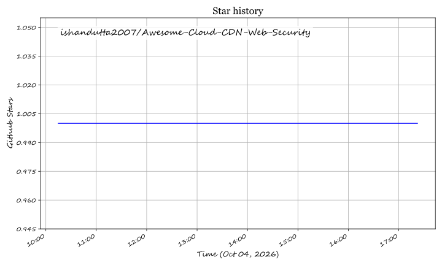

# Awesome-Cloud-CDN-Web-Security

# Awesome-Cloud-CDN-Web-Security

**Curated List of SaaS Products & Open-Source GitHub Projects**

*Focused on Content Delivery Networks, Web Application Firewalls & DDoS Protection*

**Last updated: October 2026**

This repository tracks notable **SaaS platforms** and **open-source projects** for **Cloud CDN & Web Security**. These tools help organizations accelerate content delivery, protect web applications from OWASP Top 10 threats, and mitigate DDoS attacks at the edge.

**Examples** include Azure Front Door, Cloudflare, Fastly, AWS CloudFront, Akamai Connected Cloud, Imperva Cloud WAF, Edgio, Bunny.net, StackPath, and KeyCDN (the category leaders).

**Open-source emphasis**: Cloud CDN & Web Security has a **growing open-source ecosystem** for WAF, reverse proxy, and edge delivery, though **no open-source alternative matches the global PoP footprint of commercial CDNs**. **BunkerWeb** provides a cloud-native WAF/WAAP with OWASP Top 10 protection, antibot, and DDoS mitigation, deployable on Linux, Docker, and Kubernetes . **OpenResty Edge** consolidates private CDN, WAF, and API gateway into a single on-premises platform with WAF performance "an order of magnitude" better than ModSecurity . **GoEdge** offers a free, open-source CDN & WAF system supporting HTTP/HTTPS/TCP/UDP with multi-user and cluster management . **Caddy** delivers automatic HTTPS and reverse proxy with a simple configuration model . This section documents these production-grade solutions.

Contributions welcome! Open a PR to add/update entries. Keep descriptions factual and link to official sites.

## 📖 Table of Contents

- [☁️ SaaS/Hosted Platforms](#-saas-hosted-platforms)

- [🔓 Open-Source GitHub Projects](#-open-source-github-projects)

- [🤝 How to Contribute](#-how-to-contribute)

- [⚠️ Disclaimer](#-disclaimer)

## ☁️ SaaS/Hosted Platforms

> **📊 Market Context**: The global CDN and web security market is estimated at **~$35B in 2026**, growing toward **~$95B by 2032** at a **~18% CAGR** (MarketsandMarkets / Mordor Intelligence estimates). The sector is **highly concentrated** — **Cloudflare** alone generated **$2.17B in FY2025 revenue** (+29.85% YoY), **Fastly** reported **$624M in FY2025** (+15% YoY), and **Akamai** remains the incumbent with a mature enterprise base . Cloudflare, Akamai, and AWS CloudFront collectively capture the majority of global traffic. The market exhibits **winner-take-all dynamics** at the infrastructure layer — scale begets more PoPs, better DDoS absorption, and lower unit costs. No open-source alternative can replicate this network effect without building a global anycast footprint.

| Platform | Description | Pricing (Starting Tier) | Free Tier Limits | Company Size |
|----------|-------------|------------------------|------------------|--------------|
| **[Cloudflare](https://www.cloudflare.com/)** | The leading connectivity cloud with CDN, WAF, DDoS protection, and edge compute. 330+ PoPs globally. | **Pro**: $20/month (per site); **Business**: $200/month; **Enterprise**: Custom. **Workers Paid**: $5/month + $0.30 per million requests. | **Free plan**: Unlimited bandwidth (HTML/CSS/JS/small images), basic DDoS mitigation, limited WAF ruleset, **no per-GB bill**. **ToS restriction**: Primarily-video or large-file traffic must pair with Stream or R2 . | **$2.17B revenue (FY2025), +29.85% YoY** |
| **[Fastly](https://www.fastly.com/)** | Edge cloud platform with real-time purging and Compute@Edge. 90+ PoPs. | **Pay-as-you-go**: ~$0.12/GB (NA), ~$0.19/GB (EU), ~$0.28/GB (Asia). **$50/month minimum** on paid plans. **Flat-rate**: From $1,500/month (100M requests) . | **14-day free trial** with full access. **No perpetual free tier**. Custom domain certificate is **paid add-on even during trial** . | **$624M revenue (FY2025), +15% YoY**  |
| **[Akamai Connected Cloud](https://www.akamai.com/)** | The original CDN with the largest edge footprint (4,000+ locations). Enterprise security and delivery. | **Custom enterprise pricing** — quote required. Typical enterprise CDN contracts range from **$50K–$500K+/year** depending on volume. | **None** — enterprise sales engagement required. No public free tier. | **~$4B+ revenue (Akamai FY2025 est.), Adjusted EBITDA $1.802B**  |
| **[AWS CloudFront](https://aws.amazon.com/cloudfront/)** | AWS's global CDN with 600+ PoPs. Deep integration with S3, EC2, and AWS WAF. | **First 9 TB**: $0.085/GB (US/Canada/Mexico); **next 40 TB**: $0.080/GB. **$0.0075 per HTTP request** . | **AWS Free Tier**: **1 TB data transfer + 10M HTTP/HTTPS requests per month** (new AWS accounts, 12 months) . No perpetual free tier. | **~$638B revenue (Amazon FY2025)** |
| **[Azure Front Door](https://azure.microsoft.com/en-us/products/frontdoor/)** | Microsoft's modern cloud CDN with global anycast, WAF, and DDoS protection. | **Standard**: From **~$35/month** + **$0.08/GB** (first 10 TB). **Premium**: From **~$330/month** + **$0.15/GB**. | **Azure free tier**: No perpetual CDN tier. **30-day free trial** via Azure subscription credits. | **~$281B revenue (Microsoft FY2025)** |
| **[Bunny.net](https://bunny.net/)** | Budget CDN with 119 PoPs, flat per-GB pricing, and free SSL. | **Standard Network**: **$0.01/GB**; **Volume Network**: **$0.005/GB**. **$1/month minimum** . | **14-day free trial** with full access. **Free Let's Encrypt SSL per custom hostname** (better default TLS than Fastly trial) . | **Private (~$50M+ ARR est.)** |
| **[Imperva Cloud WAF](https://www.imperva.com/)** | Enterprise WAF with DDoS mitigation, bot management, and API protection. Acquired by Thales (2023). | **Custom enterprise pricing** — quote required. Reported entry contracts start at **~$5,000/year** for small deployments. | **None** — enterprise demo required. **30-day free trial** available for Imperva Cloud WAF on request. | **Part of Thales Cyber & Digital (~€3.85B revenue)**  |
| **[Edgio](https://edg.io/)** | Edge platform with CDN, WAF, and application delivery. Formerly Limelight Networks + Edgecast. | **Custom enterprise pricing** — quote required. Entry contracts typically **$2,000–$10,000/month** depending on volume. | **None** — enterprise demo required. | **Private (~$300M+ revenue est., Chapter 11 2024)** |
| **[StackPath](https://www.stackpath.com/)** | Edge computing and CDN platform with WAF and DDoS protection. | **Custom pricing** — no public per-GB rates. Entry contracts typically **$500–$2,000/month**. | **None** — sales engagement required. | **Private (~$400M+ raised)** |
| **[KeyCDN](https://www.keycdn.com/)** | Developer-friendly CDN with transparent pricing and HTTP/3 support. | **Pay-as-you-go**: From **$0.04/GB** (EU/NA) to **$0.12/GB** (Asia). **$10 minimum/month**. | **None** — no free tier. **14-day free trial** available on request. | **Private (part of proinity LLC)** |

## 🔓 Open-Source GitHub Projects

Sorted by Stars_Count (descending). Stars_Badge links to each repo's stargazers page.

| Repo | Description | Stars Badge | GitHub Stars |
|---|---|---|---|
| **[Caddy](https://github.com/caddyserver/caddy)** | Web server with **automatic HTTPS by default**, HTTP/3, and reverse proxy/load balancer capabilities. Written in Go. Apache-2.0. |  | ~62,000 |
| **[OpenResty](https://github.com/openresty/openresty)** | Programmable web platform built on NGINX and LuaJIT. Extends NGINX with Lua scripting for sophisticated routing, authentication, and traffic management. BSD-2-Clause. |  | ~12,500 |
| **[CrowdSec](https://github.com/crowdsecurity/crowdsec)** | Open-source, collaborative IPS/IDS with **AppSec WAF engine**. Blocks SQLi, XSS, and OWASP Top 10 via bouncers integrated with Caddy, Nginx, and more. MIT. |  | ~10,000 |
| **[ModSecurity](https://github.com/SpiderLabs/ModSecurity)** | The original open-source WAF engine. Cross-platform, works with Apache, Nginx, and IIS. Apache-2.0. |  | ~8,500 |
| **[BunkerWeb](https://github.com/bunkerity/bunkerweb)** | **Open-source, cloud-native WAF/WAAP** with OWASP Top 10 protection, antibot, DDoS mitigation, SSL offloading, and caching. Runs on Linux, Docker, and Kubernetes. AGPL-3.0 . |  | ~7,500 |
| **[GoEdge](https://github.com/TeaOSLab/EdgeAdmin)** | **Free, open-source CDN & WAF system** with multi-user, cluster management, HTTP/HTTPS/TCP/UDP support, WAF, caching, DNS auto-resolution, and free certificate application. |  | ~4,200 |
| **[Coraza](https://github.com/corazawaf/coraza)** | **OWASP Coraza WAF** — enterprise-grade, open-source WAF library in Go. Modern replacement for ModSecurity. Apache-2.0. |  | ~2,800 |
| **[NyxGuard Manager](https://github.com/NyxCloudRO/NyxGuardManager)** | **Free, self-hosted WAF and reverse proxy** built on nginx. Single Docker container with SQL Shield, DDoS Shield, Bot Defence, GeoIP blocking, Let's Encrypt SSL, and Prometheus metrics. |  | ~1,500 |

**Additional open-source options worth exploring:**

| Repo | Description |

|---|---|

| **[BunkerWeb Docker](https://hub.docker.com/r/bunkerity/bunkerweb)** — Official Docker image for BunkerWeb WAF. Deploy a full WAF in minutes with `docker run`.  |  |

| **[Caddy Plus (Docker)](https://hub.docker.com/r/iamdockin/caddy-plus)** — Pre-built Caddy container with CrowdSec WAF, OIDC, Cloudflare DNS, and reverse proxy plugins.  |  |

| **[OpenResty Edge](https://blog.openresty.com/en/what-is-openresty-edge/)** — Commercial platform built on OpenResty for private CDN + WAF + gateway. **Case study**: Major OTA deployed 100+ nodes, improved latency by 100ms.  |  |

## 🤝 How to Contribute

1. Fork the repo.

2. Add/edit entries in `README.md` (follow existing format).

3. Include: name, link, 1–2 sentence description, and whether it's SaaS or open-source.

4. Submit PR with a short explanation.

Star the repo if you find it useful!

## ⚠️ Disclaimer

- This is a **community-curated** list — not exhaustive and not an endorsement.

- CDN and WAF platforms handle sensitive traffic and can terminate TLS; ensure proper certificate management, security configuration, and compliance with organizational policies.

- **Open-source reality**: **No open-source alternative matches the global PoP footprint of Cloudflare (330+), CloudFront (600+), or Akamai (4,000+).** Open-source WAF and reverse proxy solutions (**BunkerWeb**, **CrowdSec**, **ModSecurity**, **Coraza**) provide **OWASP Top 10 protection and DDoS mitigation** that can be deployed on your own infrastructure, but they require you to **build and operate your own edge network** — a significant engineering investment. **GoEdge** offers a free CDN & WAF system for those willing to self-host. **OpenResty Edge** consolidates private CDN, WAF, and gateway with on-premises deployment. The open-source path is **genuinely viable** for organizations with strong infrastructure engineering capacity seeking full data sovereignty and zero per-GB CDN costs.

- **Pricing caveat**: All pricing figures above are **verified against cited search results** but may change without notice. Cloud provider costs (compute, storage, egress) are often billed separately. Always request a formal quote for accurate budgeting.

---

**Made for DevOps engineers, security architects, platform teams, and web infrastructure specialists.**

Let's make content delivery and web security more open, transparent, and resilient.

## ⭐ Star History

<a href="https://star-history.com/#ishandutta2007/Awesome-Cloud-CDN-Web-Security&Timeline" align="center">
  <picture>
    <source media="(prefers-color-scheme: dark)" srcset="assets/ishandutta2007_Awesome-Cloud-CDN-Web-Security_growth.svg">
    
  </picture>
</a>
